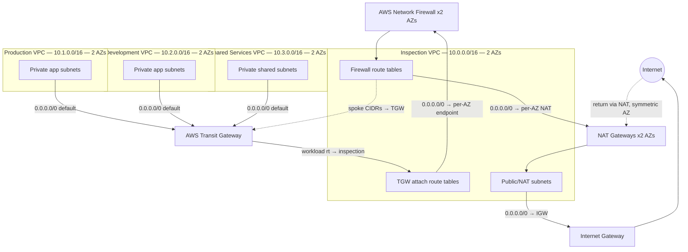

# AWS Network Firewall Security Hub

A production-style, deployment-ready centralized AWS network-security reference architecture using **AWS Network Firewall**, **AWS Transit Gateway**, multiple Amazon VPCs, **Terraform**, Suricata-compatible IPS rules, **CloudWatch** monitoring, **Amazon S3** log archival, automated **pytest** suites, and **GitHub Actions** CI/CD.

> **Deployment status:** Designed, statically validated, and deployed to AWS for runtime testing (since cleaned up). The centralized inspection routing has a known runtime defect (documented in `docs/limitations.md`). Not yet "deployed and validated."

---

## Table of Contents

1. [Architecture Overview](#architecture-overview)
2. [Network Topology](#network-topology)
3. [Security Controls](#security-controls)
4. [Traffic Policy Matrix](#traffic-policy-matrix)
5. [Repository Structure](#repository-structure)
6. [Terraform Modules](#terraform-modules)
7. [Firewall Rules](#firewall-rules)
8. [CI/CD Pipeline](#cicd-pipeline)
9. [Prerequisites](#prerequisites)
10. [Local Validation](#local-validation)
11. [Deployment Guide](#deployment-guide)
12. [Testing](#testing)
13. [Cost Considerations](#cost-considerations)
14. [Limitations](#limitations)
15. [Portfolio](#portfolio)

---

## Architecture Overview



### Design principles

- **Centralized inspection**: all workload egress and cross-VPC traffic flows through a single AWS Network Firewall in a dedicated inspection VPC.
- **No direct internet access for workloads**: workload VPCs have no Internet Gateway; egress is forced through the Transit Gateway → inspection VPC → firewall → NAT → IGW.
- **High availability**: firewall, NAT gateways, and TGW attachments span two Availability Zones.
- **Symmetric routing**: Transit Gateway appliance mode on the inspection attachment keeps return traffic on the same AZ.
- **SSM over PrivateLink**: management traffic stays on the AWS backbone (no SSH/RDP, no public endpoints).
- **Strict egress allowlist**: HTTP/HTTPS egress is allowed only to approved domains via a Network Firewall ALLOWLIST rule group.

---

## Network Topology

| VPC | CIDR | Subnets (AZ A / AZ B) | Purpose |
|-----|------|-----------------------|---------|
| Inspection | 10.0.0.0/16 | firewall 10.0.1.0/24 / 10.0.2.0/24 | NFW endpoints |
| | | tgw 10.0.3.0/24 / 10.0.4.0/24 | TGW attachment |
| | | public 10.0.5.0/24 / 10.0.6.0/24 | NAT gateways + IGW |
| Production | 10.1.0.0/16 | app 10.1.1.0/24 / 10.1.2.0/24 | Private workloads |
| | | tgw 10.1.3.0/24 / 10.1.4.0/24 | TGW attachment |
| Development | 10.2.0.0/16 | app 10.2.1.0/24 / 10.2.2.0/24 | Private workloads |
| | | tgw 10.2.3.0/24 / 10.2.4.0/24 | TGW attachment |
| Shared Services | 10.3.0.0/16 | shared 10.3.1.0/24 / 10.3.2.0/24 | Admin / DNS / logging |
| | | tgw 10.3.3.0/24 / 10.3.4.0/24 | TGW attachment |

### Transit Gateway route table domains

| Route Table | Associated Attachments | Key Routes |
|-------------------------------------|------------|
| workload | production, development | 0.0.0.0/0 → inspection |
| shared_services | shared_services | 0.0.0.0/0 → inspection |
| inspection | inspection | propagated: 10.1/10.2/10.3 → spoke attachments |

### Packet paths

**Egress (workload → internet):**

1. Workload app subnet → 0.0.0.0/0 → TGW
2. TGW workload route table → 0.0.0.0/0 → inspection attachment
3. Inspection TGW subnet → 0.0.0.0/0 → per-AZ firewall endpoint
4. Firewall inspects (stateful Suricata rules)
5. Firewall subnet → 0.0.0.0/0 → per-AZ NAT Gateway
6. NAT → public subnet → IGW → Internet

**Cross-VPC (e.g., production → shared services):**

1. Production app → TGW → inspection → firewall
2. Firewall inspects; firewall subnet → spoke CIDR → TGW → shared services

**Return:** symmetric via appliance mode (same AZ).

---

## Security Controls

| Control | Implementation |
|---------|---------------|
| No public IPs on workloads | `associate_public_ip_address = false` |
| No SSH/RDP ingress | SSM-only; test SG has no ingress |
| IMDSv2 required | `http_tokens = "required"` on all test instances |
| EBS encryption | `encrypted = true` on all volumes |
| Default SG restricted | `aws_default_security_group` with no rules |
| S3 public access blocked | `block_public_acls/policy/ignore/restrict = true` |
| S3 encryption | SSE-S3 (AWS-managed) |
| S3 versioning + lifecycle | Enabled with Standard-IA → Deep Archive transitions |
| NFW STRICT_ORDER | First-match-wins; explicit priorities |
| Egress allowlist | Domain ALLOWLIST (only approved domains for HTTP/HTTPS) |
| DNS blocking | Unauthorized UDP/TCP 53 blocked |
| Dev→Prod blocking | Drop rules for SSH and all ports |
| Telnet blocking | Drop on port 23 |
| Prohibited IP set | Drop to RFC 5737 TEST-NET ranges |
| SSM PrivateLink | Interface endpoints for ssm/ssmmessages/ec2messages |
| Production protection | Check block enforces firewall protection flags |
| GitHub Actions SHA-pinned | All third-party actions pinned to commit SHAs |
| Blocking Checkov | IaC security scanning fails CI on findings |
| Gitleaks | Secret scanning in CI |

---

## Traffic Policy Matrix

| Source | Destination | Protocol | Expected | Rule |
|--------|------------|----------|----------|------|
| Production | Internet (allowed domain) | HTTPS | Allow | ALLOWLIST (priority 60) |
| Development | Internet (allowed domain) | HTTPS | Allow | ALLOWLIST |
| Production | Internet | Telnet | Block + alert | deny sid 10000022 |
| Development | Production | SSH | Block + alert | deny sid 10000020 |
| Development | Production | any port | Block | deny sid 10000021 |
| Shared Services | Production | SSH | Allow | allow sid 10000010 |
| Production | Shared Services | 514/tcp | Allow | allow sid 10000011 |
| Workloads | Shared Services | DNS 53 | Allow | dns sid 10000040/41 |
| Workloads | External | DNS 53 UDP | Block | deny sid 10000023 |
| Workloads | External | DNS 53 TCP | Block | deny sid 10000025 |
| Any workload | Restricted domain | HTTP/HTTPS | Block | DENYLIST (priority 50) |
| Any workload | Prohibited IP set | any | Block | deny sid 10000024 + stateless |
| Any VPC | Unapproved cross-VPC | any | Block | stateful default `drop_strict` |
| Return | Established | relevant | Allow | stateful tracking |

---

## Repository Structure

```text
aws-network-firewall-security-hub/
├── AGENTS.md                          # Codex operating instructions
├── README.md                          # This file
├── LICENSE                            # MIT
├── Makefile                           # Validation targets (graceful skip)
├── pytest.ini                         # pytest configuration
├── .gitignore .gitattributes .editorconfig .pre-commit-config.yaml
├── .markdownlint.json .yamllint.yaml  # Lint configs
│
├── architecture/
│   ├── architecture.md                # Narrative architecture
│   ├── routing-design.md              # Route tables + packet paths
│   ├── security-boundaries.md         # Trust zones + controls
│   ├── traffic-flows.md               # Allowed/blocked flow table
│   └── diagrams/
│       └── architecture.mmd           # Mermaid topology diagram
│
├── docs/
│   ├── deployment-guide.md            # Staged deployment
│   ├── validation-guide.md            # Static + runtime validation
│   ├── operations-runbook.md          # Daily ops + common changes
│   ├── incident-response-playbook.md  # Detect/triage/contain
│   ├── cost-considerations.md         # Cost drivers + minimization
│   ├── security-decisions.md          # Architectural decisions
│   ├── firewall-logging.md            # Log fields + troubleshooting
│   ├── limitations.md                 # Known limitations + runtime defect
│   └── portfolio-demo.md              # Demo script
│
├── terraform/
│   ├── versions.tf providers.tf       # Provider + version constraints
│   ├── main.tf                        # Root composition (all modules)
│   ├── variables.tf outputs.tf locals.tf
│   ├── .tflint.hcl                    # TFLint config (AWS ruleset)
│   ├── environments/
│   │   ├── lab/                       # Lab tfvars example
│   │   └── production/                # Production tfvars (protection enabled)
│   └── modules/
│       ├── vpc/                       # Reusable VPC (map-driven subnets)
│       ├── transit-gateway/           # TGW + attachments + route tables
│       ├── inspection-routing/        # NAT + centralized route entries
│       ├── network-firewall/          # HA firewall (2 AZ endpoints)
│       ├── firewall-policy/           # Policy + 7 rule groups + STRICT_ORDER
│       ├── logging/                   # CloudWatch + S3 archival
│       ├── monitoring/                # Dashboard + alarms + metric filters
│       ├── test-workload/             # Optional private test instances (SSM)
│       └── ssm-vpc-endpoints/         # PrivateLink endpoints for SSM
│
├── rules/
│   ├── stateful/
│   │   ├── allow.rules                # Pass: mgmt SSH, prod→shared logging
│   │   ├── deny.rules                 # Drop: dev→prod, telnet, DNS, IPs
│   │   ├── alert.rules                # Alert: suspicious ports, RDP
│   │   └── dns.rules                  # Pass: DNS to approved resolver
│   ├── stateless/stateless-rules.yaml # Stateless drop spec
│   ├── domain-lists/
│   │   ├── allowed-domains.txt        # Egress allowlist
│   │   └── blocked-domains.txt        # Domain blocklist
│   └── ip-sets/
│       ├── home-networks.txt          # Workload CIDRs (doc)
│       └── blocked-destinations.txt   # TEST-NET ranges
│
├── scripts/
│   ├── validate.sh                    # Run all available tools
│   ├── test-firewall-rules.sh         # Rule artifact validation
│   ├── test-routes.sh                 # Read-only AWS route inspection
│   ├── test-connectivity.sh           # Safe traffic scenario runner
│   ├── generate-test-traffic.py       # Scenario-based traffic generator
│   ├── analyze-firewall-logs.py       # Firewall log summarizer
│   ├── bootstrap.sh                   # Local setup instructions
│   └── estimate-costs.sh              # Cost driver reference
│
├── tests/
│   ├── terraform/
│   │   ├── test_structure.py          # Structure + leak guards (8 tests)
│   │   ├── test_security.py           # S3/SG/IAM/firewall (14 tests)
│   │   ├── test_routing.py            # Centralized inspection (14 tests)
│   │   ├── test_naming.py             # Naming conventions (4 tests)
│   │   └── test_ssm_endpoints.py      # SSM PrivateLink (12 tests)
│   ├── rules/
│   │   ├── test_suricata_rules.py     # SID/msg/flow validation (16 tests)
│   │   └── test_domain_lists.py       # Domain/IP-set integrity (6 tests)
│   ├── test_utilities.py              # Traffic + log analyzer (16 tests)
│   └── fixtures/
│       └── sample-alert-logs.json     # Sanitized fixture data
│
├── examples/
│   ├── minimal/                       # Smallest HA config
│   └── complete/                      # Full logging + monitoring + tests
│
└── .github/
    ├── workflows/
    │   ├── terraform.yml              # fmt + init + validate + tflint (blocking)
    │   ├── security.yml               # checkov (blocking) + trivy (advisory) + gitleaks
    │   ├── tests.yml                  # pytest + shellcheck + yamllint
    │   └── documentation.yml          # markdownlint + lychee (offline)
    ├── ISSUE_TEMPLATE/
    │   ├── bug_report.yml
    │   └── feature_request.yml
    └── pull_request_template.md
```

---

## Terraform Modules

| Module | Resources | Purpose |
|--------|-----------|---------|
| `vpc` | VPC, subnets, route tables, default SG, optional IGW, optional flow logs | Reusable VPC with map-driven subnets |
| `transit-gateway` | TGW, attachments, route tables, associations, propagations, routes | Centralized connectivity with explicit routing |
| `inspection-routing` | NAT gateways, EIPs, route entries | Centralized egress + firewall routing |
| `network-firewall` | Firewall, logging config | HA firewall (2 AZ endpoints) |
| `firewall-policy` | Policy, 7 rule groups, STRICT_ORDER | Stateful + stateless rules with domain lists |
| `logging` | CloudWatch log groups, S3 bucket, resource policies | Operational + archival logging |
| `monitoring` | Dashboard, metric filters, alarms, optional SNS | Firewall observability |
| `test-workload` | EC2 instances, SGs, IAM role | Optional private test instances (SSM-only) |
| `ssm-vpc-endpoints` | 9 interface endpoints, 3 SGs | PrivateLink for SSM management |

---

## Firewall Rules

### Stateful rule evaluation order (STRICT_ORDER)

| Priority | Group | Type | Effect |
|----------|-------|------|--------|
| 50 | blocked-domains | DENYLIST | Drop listed domains (TLS_SNI / HTTP_HOST) |
| 60 | allowed-domains | ALLOWLIST | Allow listed domains; drop all other HTTP/HTTPS |
| 100 | deny | 5-tuple drop | Telnet, dev→prod, unauthorized DNS, prohibited IPs |
| 200 | alert | 5-tuple alert | Suspicious ports, outbound RDP (alert only) |
| 300 | dns | 5-tuple pass | DNS to approved resolver (UDP + TCP) |
| 400 | allow | 5-tuple pass | Mgmt SSH, prod→shared logging |
| default | — | `drop_strict` | Anything unmatched is dropped |

### SID allocation

| Range | File |
|-------|------|
| 10000010–10000019 | allow.rules |
| 10000020–10000029 | deny.rules |
| 10000030–10000039 | alert.rules |
| 10000040–10000049 | dns.rules |

All rules are **single-line** (AWS Network Firewall requirement). See `rules/README.md` for details.

---

## CI/CD Pipeline

| Workflow | Triggers | Checks | Blocking? |
|----------|----------|--------|-----------|
| `terraform` | PR + push (terraform/**) | fmt, init, validate, tflint | ✅ All |
| `security` | PR + push | checkov, trivy (advisory), gitleaks | ✅ checkov + gitleaks |
| `tests` | PR + push (tests/scripts/rules/terraform/**) | pytest, shellcheck, yamllint | ✅ All |
| `documentation` | PR + push (**/*.md) | markdownlint, lychee (offline) | ✅ All |

All third-party actions are **pinned to immutable commit SHAs**. No workflow runs `terraform apply`.

---

## Prerequisites

- Terraform `>= 1.5.0, < 2.0`
- AWS provider `~> 5.0`
- Python 3.10+ with `pytest`
- Optional: `tflint`, `checkov`, `tfsec`, `shellcheck`, `yamllint`, `markdownlint`, `pre-commit`

---

## Local Validation

```bash
make validate
# or
scripts/validate.sh
```

### Manual commands

```bash
cd terraform
terraform fmt -check -recursive
terraform init -backend=false
terraform validate
cd ..
pytest                          # 80 tests
checkov -d terraform            # 274 passed, 0 failed
shellcheck scripts/*.sh
yamllint -c .yamllint.yaml .
```

---

## Deployment Guide

See `docs/deployment-guide.md` for the full staged guide. Summary:

1. **Static validation** (`make validate`) — no AWS credentials.
2. **Read-only planning** (`terraform plan -out=tfplan`) — credentials required.
3. **Human-reviewed deployment** (`terraform apply tfplan`) — explicit approval only.
4. **Traffic validation** — run test scenarios.
5. **Evidence capture** — sanitized outputs.
6. **Cleanup** (`terraform destroy`) — explicit approval only.

---

## Testing

```bash
# Static tests (80 tests)
pytest -q

# Rule validation
scripts/test-firewall-rules.sh

# Traffic scenarios (dry-run)
scripts/test-connectivity.sh

# Log analysis
python scripts/analyze-firewall-logs.py tests/fixtures/sample-alert-logs.json
```

---

## Cost Considerations

This architecture may incur AWS charges for:

- AWS Network Firewall endpoints (2 for HA) — per-endpoint hourly + per-GB processing
- Transit Gateway (per-attachment hourly + per-GB data processing)
- NAT Gateways (2 for HA) — per-endpoint hourly + per-GB
- CloudWatch Logs ingestion + retention
- S3 storage + lifecycle transitions
- EC2 test instances (when `enable_test_workloads = true`)
- SSM VPC endpoints (9 interface endpoints — per-endpoint-AZ hourly)
- Cross-AZ data transfer

Review current AWS pricing before deploying. See `docs/cost-considerations.md`.

---

## Limitations

- Static tests prove intent, not runtime behavior.
- AWS Network Firewall does not provide full Suricata feature parity.
- **Runtime defect**: centralized inspection routing — firewall received 0 packets despite correct route config. Requires VPC flow logs debugging.
- SSM access resolved via PrivateLink (documented in `docs/limitations.md`).

See `docs/limitations.md` for full details.

---

## Portfolio

> Built a deployment-ready centralized AWS network-security platform using AWS Network Firewall, Transit Gateway, multiple VPCs, Terraform, Suricata-compatible IPS rules, CloudWatch monitoring, S3 log archival, SSM PrivateLink, automated security testing, and GitHub Actions.

### Resume bullet

- Designed and deployed a centralized AWS Network Firewall inspection architecture across multi-VPC Transit Gateway topologies using Terraform, Suricata-compatible rules, CloudWatch monitoring, S3 log archival, SSM PrivateLink management, automated pytest suites (80 tests), blocking Checkov IaC scanning, and SHA-pinned GitHub Actions CI/CD.

### Demo script

See `docs/portfolio-demo.md` for a 5-minute walkthrough.

### Release

`v0.1.0` — centralized inspection reference (statically validated, deployed for runtime testing, cleaned up).

---

## Disclaimer

Deployment status must be represented honestly. This project was deployed to AWS for runtime testing and has since been cleaned up (`terraform destroy` completed). The centralized inspection routing has a known runtime defect. Use "designed and statically validated" until all runtime tests pass with preserved evidence.
