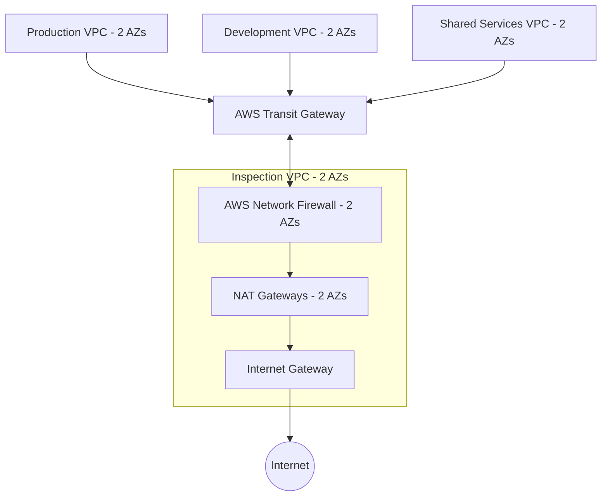

# AWS Network Firewall Security Hub

A deployment-ready, statically validated reference implementation of a centralized multi-VPC AWS network-security platform built with **AWS Network Firewall**, **AWS Transit Gateway**, **Terraform**, **Suricata-compatible IPS rules**, **CloudWatch**, **Amazon S3**, automated testing, and **GitHub Actions**.

> **Deployment status:** Designed and statically validated. This project has **not** been deployed or traffic-tested in AWS yet. Do not claim "deployed and validated" until real deployment and test evidence is captured.

## Business problem

Organizations need a single, centralized inspection point for all east-west and north-south traffic so that security policy is enforced consistently across production, development, and shared-services environments. This repository demonstrates that pattern without exposing workloads directly to the internet and without relying on per-VPC security appliances.

## Architecture (target)



A fuller diagram with Availability Zones, route tables, and return paths is added in the documentation phase. See `architecture/architecture.md` (TODO: Phase 7).

## Security controls

- Centralized AWS Network Firewall inspection for all workload egress and cross-VPC traffic.
- No direct internet gateway path from workload VPCs; egress is forced through inspection.
- No public IP addresses on workload instances.
- AWS Systems Manager (SSM) preferred over public SSH/RDP for administration.
- S3 log bucket with public access blocked, encryption enabled, and lifecycle rules.
- Least-privilege security groups and IAM roles.
- IMDSv2 required on test instances; EBS encryption enabled.

## Traffic-policy matrix

| Source | Destination | Protocol | Expected result |
| ----------------- | ---------------------------- | --------------------: | ---------------- |
| Production | Internet | HTTPS | Allow |
| Development | Internet | HTTPS | Allow |
| Production | Internet | Telnet | Block and alert |
| Development | Production | SSH | Block and alert |
| Development | Production | Application port | Block by default |
| Management subnet | Production | SSH | Allow |
| Production | Shared Services | Approved logging port | Allow |
| Workload VPCs | Approved DNS resolver | DNS | Allow |
| Workload VPCs | Unauthorized DNS resolver | DNS | Block |
| Any workload | Restricted domain | HTTP/HTTPS | Block |
| Any workload | Known prohibited IP set | Any | Block |
| Any VPC | Unapproved cross-VPC traffic | Any | Block |
| Return traffic | Established connection | Relevant protocol | Allow statefully |

The routing design prevents workloads from bypassing the inspection path.

## Repository structure

```text
aws-network-firewall-security-hub/
├── AGENTS.md
├── README.md
├── LICENSE
├── Makefile
├── .gitignore
├── .editorconfig
├── .pre-commit-config.yaml
├── architecture/        # architecture, routing, security-boundary, traffic-flow docs + diagrams
├── docs/               # deployment, validation, operations, incident-response, cost, security-decisions
├── terraform/
│   ├── versions.tf providers.tf main.tf variables.tf outputs.tf locals.tf
│   ├── environments/
│   │   ├── lab/
│   │   └── production/
│   └── modules/
│       ├── vpc/
│       ├── transit-gateway/
│       ├── inspection-routing/
│       ├── network-firewall/
│       ├── firewall-policy/
│       ├── logging/
│       ├── test-workload/
│       └── monitoring/
├── rules/              # Suricata stateful rules, stateless rules, domain lists, IP sets
├── scripts/            # bootstrap, validate, connectivity/route/firewall tests, traffic + log tools
├── tests/              # pytest suites for terraform structure/security/routing/naming and rules
└── .github/            # GitHub Actions workflows and templates
```

## Prerequisites

- Terraform `>= 1.5.0, < 2.0`
- AWS provider `~> 5.0`
- Python 3.10+ with `pytest`
- Optional: `tflint`, `checkov`, `tfsec`, `shellcheck`, `yamllint`, `markdownlint`, `pre-commit`

Static validation works **without** AWS credentials.

## Local validation

```bash
make validate
```

The Makefile runs each tool only when installed and reports skipped tools clearly. See `Makefile`.

### Manual commands

```bash
terraform fmt -check -recursive
terraform init -backend=false
terraform validate
pytest
shellcheck scripts/*.sh
```

## Deployment steps

> TODO: expanded in `docs/deployment-guide.md` (Phase 7). Summary:

1. Static validation (`make validate`) — no AWS credentials.
2. Read-only planning (`terraform init && terraform plan -out=tfplan`) — credentials required; never commit `tfplan`.
3. Human-reviewed deployment (`terraform apply tfplan`) — only after manual approval.
4. Traffic validation of allowed and blocked test cases.
5. Evidence capture (sanitized outputs, route tables, firewall policy, CloudWatch samples).
6. Cleanup (`terraform destroy`) — only after explicit approval.

## Testing steps

> TODO: expanded in `docs/validation-guide.md` (Phase 7).

## Example expected results

> TODO: populated with test fixtures and analyzer output in Phase 6.

## Cost warning

> TODO: expanded in `docs/cost-considerations.md` (Phase 7). This architecture may incur costs for AWS Network Firewall endpoints, traffic processing, Transit Gateway attachments/processing, NAT Gateways, CloudWatch Logs ingestion/retention, S3 storage, EC2 test instances, and cross-AZ traffic. Review current AWS pricing before deploying.

## Cleanup steps

> TODO: documented cleanup order and retained logging resources in `docs/deployment-guide.md` (Phase 7).

## Limitations

> TODO: expanded in `docs/limitations.md` (Phase 7). Static tests do not prove packet-level behavior; runtime validation in AWS is still required.

## Portfolio demonstration

> Built a deployment-ready centralized AWS network-security platform using AWS Network Firewall, Transit Gateway, multiple VPCs, Terraform, Suricata-compatible IPS rules, CloudWatch monitoring, S3 log archival, automated security testing, and GitHub Actions.

## Resume bullet

- Designed and statically validated a centralized AWS Network Firewall inspection architecture across multi-VPC Transit Gateway topologies using Terraform, Suricata-compatible rules, CloudWatch monitoring, S3 log archival, automated pytest suites, and GitHub Actions CI.

## Disclaimer

Deployment status must be represented honestly. Use "designed and statically validated" until the project has actually been deployed and tested in AWS with preserved evidence. Only use "deployed and validated" after capturing real deployment and test evidence.
