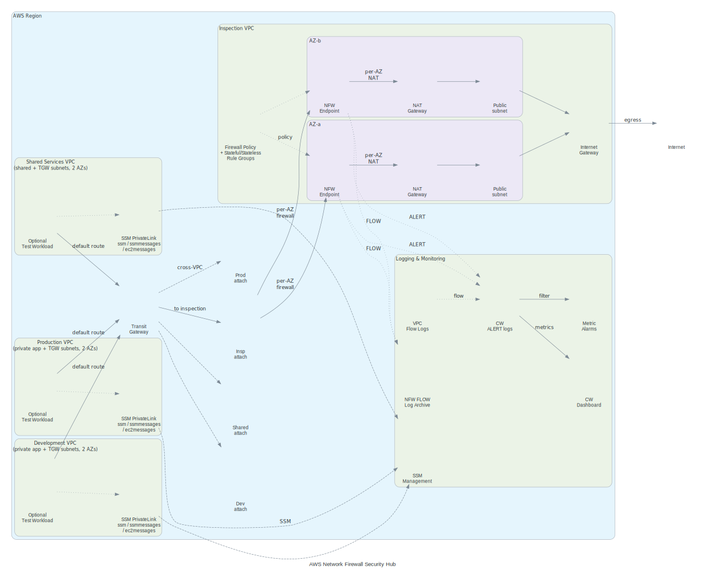
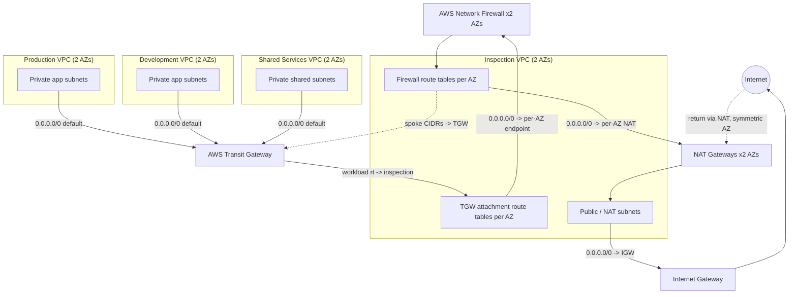

# AWS Network Firewall Security Hub


A centralized multi-VPC AWS network-security reference architecture using **AWS Network Firewall**, **Transit Gateway**, **Terraform**, Suricata-compatible IPS rules, **CloudWatch** monitoring, **Amazon S3** log archival, **SSM PrivateLink** management, automated **pytest** security suites, and **GitHub Actions** CI/CD with SHA-pinned third-party actions and blocking Checkov IaC scanning.

---

## Deployment and Validation Status

> **Deployment status: Deployed and validated.** All 20 runtime tests pass against the live AWS deployment in ap-northeast-1. The architecture uses native Suricata `tls.sni` rules with `alert_strict` as the stateful default, replacing AWS Network Firewall domain-list rule groups whose asynchronous SNI evaluation caused intermittent allow/deny failures. The TCP handshake and TLS ClientHello pass through the firewall (alerted by the default), and flow-level pass/drop verdicts from `tls.sni` rules are applied consistently once the SNI is parsed. Unmatched HTTPS is denied by a catch-all `from_server` drop rule. See the Runtime Validation Matrix below for the full 20-test results.
>
> **Warning:** Terraform state files (`terraform.tfstate`) and saved plan files (`tfplan`) may contain sensitive information including resource IDs, IP addresses, and account identifiers. These files are gitignored and must never be committed, shared, or published.

---

## Business Problem

Organizations need a single, centralized inspection point for all east-west and north-south traffic so that security policy is enforced consistently across production, development, and shared-services environments. This repository demonstrates that pattern without exposing workloads directly to the internet and without relying on per-VPC security appliances.

---

## Architecture Diagram



<details>
<summary>View Mermaid traffic-flow diagram</summary>



</details>

### Regenerating the diagram

The SVG and PNG are generated artifacts produced by the Python diagrams package
(Mingrammer). The source of truth for the visual diagram is
rchitecture/diagrams/generate_architecture.py; Terraform remains the
infrastructure source of truth. Contributors must regenerate the diagram after
relevant architecture changes.

`ash
python -m pip install -r architecture/diagrams/requirements.txt
python architecture/diagrams/generate_architecture.py
`

Graphviz (the dot command) must be installed and available in PATH.

---

## Traffic Flow Explanation

**Egress (workload to internet):**

1. Workload app subnet default route (0.0.0.0/0) sends traffic to the Transit Gateway.
2. TGW workload route table forwards 0.0.0.0/0 to the inspection VPC attachment.
3. Inspection TGW attachment subnet route table forwards 0.0.0.0/0 to the per-AZ Network Firewall endpoint.
4. Firewall inspects traffic using stateful Suricata rules (STRICT_ORDER).
5. Firewall subnet default route forwards to the per-AZ NAT Gateway.
6. NAT Gateway egresses through the public subnet to the Internet Gateway.

**Cross-VPC (e.g., production to shared services):**

1. Production app subnet default route sends to the TGW.
2. TGW workload route table forwards to the inspection VPC.
3. Firewall inspects; if allowed, firewall subnet route for the destination spoke CIDR forwards back to the TGW.
4. TGW inspection route table (propagated spoke CIDRs) forwards to the destination VPC.

**Return path:** Transit Gateway appliance mode on the inspection attachment keeps return traffic on the same Availability Zone, preserving routing symmetry.

---

## Implemented AWS Services

- AWS Network Firewall (stateful Suricata-compatible IPS + stateless rules)
- AWS Transit Gateway (centralized connectivity, appliance mode)
- Amazon VPC (4 VPCs, per-subnet route tables, default SG restricted)
- NAT Gateways (2 AZs, centralized egress)
- Amazon S3 (encrypted log archival, lifecycle, public access blocked)
- CloudWatch Logs (alert log group, dashboard, metric filters, alarms)
- AWS Systems Manager (SSM Session Manager via PrivateLink interface endpoints)
- IAM (least-privilege SSM role for test instances)
- GitHub Actions (CI/CD with SHA-pinned actions)

---

## Security Controls

| Control | Implementation |
|---------|---------------|
| No public IPs on workloads | `associate_public_ip_address = false` |
| No SSH/RDP ingress | SSM-only; test SG has no ingress rules |
| IMDSv2 required | `http_tokens = "required"` on all test instances |
| EBS encryption | `encrypted = true` on all volumes |
| Default SG restricted | `aws_default_security_group` with no rules |
| S3 public access blocked | All four block flags set to `true` |
| S3 encryption | SSE-S3 (AWS-managed) |
| S3 versioning + lifecycle | Enabled with Standard-IA then Deep Archive transitions |
| NFW STRICT_ORDER | First-match-wins with explicit priorities |
| Egress allowlist | Native Suricata `tls.sni` pass rules (only approved domains for HTTPS) |
| DNS blocking | Unauthorized UDP and TCP port 53 blocked |
| Dev-to-Prod blocking | Drop rules for SSH and all ports |
| Telnet blocking | Drop on port 23 |
| Prohibited IP set | Drop to RFC 5737 TEST-NET ranges |
| SSM PrivateLink | Interface endpoints for ssm, ssmmessages, ec2messages |
| Production protection | Check block enforces firewall protection flags when `environment == "production"` |
| GitHub Actions SHA-pinned | All third-party actions pinned to immutable commit SHAs |
| Blocking Checkov | IaC security scanning fails CI on findings |
| Gitleaks | Secret scanning in CI |

---

## Traffic-Policy Matrix

| Source | Destination | Protocol | Expected | Rule |
|--------|------------|----------|----------|------|
| Production | Internet (allowed domain) | HTTPS | Allow | `tls.sni` pass (priority 55) |
| Development | Internet (allowed domain) | HTTPS | Allow | `tls.sni` pass |
| Production | Internet | Telnet | Block + alert | deny sid 10000022 |
| Development | Production | SSH | Block + alert | deny sid 10000020 |
| Development | Production | any port | Block | deny sid 10000021 |
| Shared Services | Production | SSH | Allow | allow sid 10000010 |
| Production | Shared Services | 514/tcp | Allow | allow sid 10000011 |
| Workloads | Shared Services resolver | DNS 53 | Allow | dns sid 10000040/41 |
| Workloads | External resolver | DNS 53 UDP | Block | deny sid 10000023 |
| Workloads | External resolver | DNS 53 TCP | Block | deny sid 10000025 |
| Any workload | Restricted domain | HTTPS | Block | `tls.sni` drop (priority 55) |
| Any workload | Prohibited IP set | any | Block | deny sid 10000024 + stateless |
| Any VPC | Unapproved cross-VPC | any | Block | stateful default `alert_strict` + catch-all |
| Return | Established connection | relevant | Allow statefully | stateful tracking |

---

## Repository Structure

```text
aws-network-firewall-security-hub/
├── AGENTS.md                          # Codex operating instructions
├── README.md                          # This file
├── LICENSE                            # MIT
├── Makefile                           # Validation targets (graceful skip)
├── pytest.ini                         # pytest configuration
├── .gitignore .gitattributes .editorconfig .pre-commit-config.yaml
├── .markdownlint.json .yamllint.yaml  # Lint configs
│
├── architecture/
│   ├── architecture.md                # Narrative architecture
│   ├── routing-design.md              # Route tables + packet paths
│   ├── security-boundaries.md         # Trust zones + controls
│   ├── traffic-flows.md               # Allowed/blocked flow table
│   └── diagrams/architecture.mmd      # Mermaid topology diagram
│
├── docs/
│   ├── deployment-guide.md            # Staged deployment
│   ├── validation-guide.md            # Static + runtime validation
│   ├── operations-runbook.md          # Daily ops + common changes
│   ├── incident-response-playbook.md  # Detect/triage/contain
│   ├── cost-considerations.md         # Cost drivers + minimization
│   ├── security-decisions.md          # Architectural decisions
│   ├── firewall-logging.md           # Log fields + troubleshooting
│   ├── limitations.md                 # Known limitations + runtime defect
│   └── portfolio-demo.md              # Demo script
│
├── terraform/
│   ├── versions.tf providers.tf       # Provider + version constraints
│   ├── main.tf                        # Root composition (all modules)
│   ├── variables.tf outputs.tf locals.tf
│   ├── .tflint.hcl                    # TFLint config (AWS ruleset)
│   ├── environments/
│   │   ├── lab/                       # Lab tfvars example
│   │   └── production/                # Production tfvars (protection enabled)
│   └── modules/
│       ├── vpc/                       # Reusable VPC (map-driven subnets)
│       ├── transit-gateway/           # TGW + attachments + route tables
│       ├── inspection-routing/        # NAT + centralized route entries
│       ├── network-firewall/          # HA firewall (2 AZ endpoints)
│       ├── firewall-policy/           # Policy + 6 rule groups + STRICT_ORDER
│       ├── logging/                   # CloudWatch + S3 archival
│       ├── monitoring/                # Dashboard + alarms + metric filters
│       ├── test-workload/             # Optional private test instances (SSM)
│       └── ssm-vpc-endpoints/         # PrivateLink endpoints for SSM
│
├── rules/
│   ├── stateful/
│   │   ├── allow.rules                # Pass: mgmt SSH, prod->shared logging
│   │   ├── deny.rules                 # Drop: dev->prod, telnet, DNS, IPs
│   │   ├── alert.rules                # Alert: suspicious ports, RDP
│   │   └── dns.rules                  # Pass: DNS to approved resolver
│   ├── stateless/stateless-rules.yaml # Stateless drop spec
│   ├── domain-lists/
│   │   ├── allowed-domains.txt        # Egress allowlist
│   │   └── blocked-domains.txt        # Domain blocklist
│   └── ip-sets/
│       ├── home-networks.txt          # Workload CIDRs (doc)
│       └── blocked-destinations.txt  # TEST-NET ranges
│
├── scripts/
│   ├── validate.sh                    # Run all available tools
│   ├── test-firewall-rules.sh         # Rule artifact validation
│   ├── test-routes.sh                 # Read-only AWS route inspection
│   ├── test-connectivity.sh          # Safe traffic scenario runner
│   ├── generate-test-traffic.py      # Scenario-based traffic generator
│   ├── analyze-firewall-logs.py      # Firewall log summarizer
│   ├── bootstrap.sh                   # Local setup instructions
│   └── estimate-costs.sh              # Cost driver reference
│
├── tests/
│   ├── terraform/
│   │   ├── test_structure.py          # Structure + leak guards
│   │   ├── test_security.py           # S3/SG/IAM/firewall security
│   │   ├── test_routing.py            # Centralized inspection routing
│   │   ├── test_naming.py             # Naming conventions
│   │   └── test_ssm_endpoints.py      # SSM PrivateLink validation
│   ├── rules/
│   │   ├── test_suricata_rules.py     # SID/msg/flow validation
│   │   └── test_domain_lists.py       # Domain/IP-set integrity
│   ├── test_utilities.py              # Traffic + log analyzer tests
│   └── fixtures/
│       └── sample-alert-logs.json     # Sanitized fixture data
│
├── examples/
│   ├── minimal/                       # Smallest HA config
│   └── complete/                      # Full logging + monitoring + tests
│
└── .github/
    ├── workflows/
    │   ├── terraform.yml              # fmt + init + validate + tflint (blocking)
    │   ├── security.yml               # checkov (blocking) + trivy (advisory) + gitleaks
    │   ├── tests.yml                  # pytest + shellcheck + yamllint
    │   └── documentation.yml          # markdownlint + lychee (offline)
    ├── ISSUE_TEMPLATE/
    │   ├── bug_report.yml
    │   └── feature_request.yml
    └── pull_request_template.md
```

---

## Terraform Module Overview

| Module | Key Resources | Purpose |
|--------|---------------|---------|
| `vpc` | VPC, subnets, route tables, default SG, optional IGW, optional flow logs | Reusable VPC with map-driven subnets; does not assume every VPC needs every subnet type |
| `transit-gateway` | TGW, VPC attachments, route tables, associations, propagations, routes | Centralized connectivity with explicit routing; appliance mode on inspection |
| `inspection-routing` | NAT gateways, EIPs, route entries | Centralized egress + firewall routing; prevents workload internet bypass |
| `network-firewall` | Firewall (2 AZ endpoints), logging config | HA firewall with protection flags and optional logging |
| `firewall-policy` | Policy, 6 rule groups, STRICT_ORDER | Stateful + stateless rules with native tls.sni domain rules and IP sets |
| `logging` | CloudWatch log groups, S3 bucket, resource policies | Operational alerts (CloudWatch) + encrypted S3 archival |
| `monitoring` | Dashboard, metric filters, alarms, optional SNS | Firewall observability |
| `test-workload` | EC2 instances, SGs, IAM role | Optional private test instances (SSM-only, no SSH/RDP) |
| `ssm-vpc-endpoints` | 9 interface endpoints, 3 SGs | PrivateLink for SSM management traffic |

---

## Firewall Rule Strategy

### Stateful evaluation (STRICT_ORDER)

| Priority | Group | Type | Effect |
|----------|-------|------|--------|
| 55 | tls-domains | Suricata `tls.sni` | Flow-level pass for allowed domains, drop for blocked domains, catch-all drop for unmatched HTTPS server responses |

| 100 | deny | 5-tuple drop | Telnet, dev-to-prod, unauthorized DNS, prohibited IPs |
| 200 | alert | 5-tuple alert | Suspicious ports, outbound RDP (alert only) |
| 300 | dns | 5-tuple pass | DNS to approved resolver (UDP + TCP) |
| 400 | allow | 5-tuple pass | Mgmt SSH, prod-to-shared logging |
| default | none | `alert_strict` | Unmatched traffic alerted; unmatched HTTPS server responses dropped by catch-all |

### SID allocation

| Range | File |
|-------|------|
| 10000010-10000019 | allow.rules |
| 10000020-10000029 | deny.rules |
| 10000030-10000039 | alert.rules |
| 10000040-10000049 | dns.rules |

All rules are single-line (AWS Network Firewall requirement). Drop actions also generate alert/flow logs. See `rules/README.md`.

---

## CI and Security Scanning

| Workflow | Triggers | Checks | Blocking |
|----------|----------|--------|----------|
| `terraform` | PR + push (terraform/**) | fmt, init (backend=false), validate, tflint | All blocking |
| `security` | PR + push | checkov (blocking), trivy (advisory), gitleaks | checkov + gitleaks |
| `tests` | PR + push (tests/scripts/rules/terraform/**) | pytest, shellcheck, yamllint | All blocking |
| `documentation` | PR + push (**/*.md) | markdownlint, lychee (offline links) | All blocking |

All third-party actions are pinned to immutable commit SHAs. No workflow runs `terraform apply`.

---

## Prerequisites

- Terraform `>= 1.5.0, < 2.0`
- AWS provider `~> 5.0`
- Python 3.10+ with `pytest`
- Optional: `tflint`, `checkov`, `shellcheck`, `yamllint`, `markdownlint`, `pre-commit`

Static validation works **without** AWS credentials.

---

## Authentication Guidance

Use temporary AWS credentials with a non-root IAM identity. Never use the AWS root account for deployment.

**Recommended methods:**

- AWS IAM Identity Center (SSO) with `aws configure sso` (browser-based, no long-term keys)
- AWS CLI with a named profile: `aws configure --profile <profile-name>`
- Environment variables: `AWS_ACCESS_KEY_ID`, `AWS_SECRET_ACCESS_KEY`, `AWS_SESSION_TOKEN` (temporary credentials only)

Do not paste credentials into the repository, commit messages, or documentation. Do not share credentials in pull requests or issues.

---

## Local Static Validation

```bash
make validate
# or
scripts/validate.sh
```

### Quick Start

```bash
git clone https://github.com/RIT-MESH/aws-network-firewall-security-hub.git
cd aws-network-firewall-security-hub
pytest
cd terraform
terraform init -backend=false
terraform validate
```

### Manual commands

```bash
cd terraform
terraform fmt -check -recursive
terraform init -backend=false
terraform validate
cd ..
pytest                          # 80 tests
checkov -d terraform            # 147 passed, 0 failed, 29 skipped
shellcheck scripts/*.sh
yamllint -c .yamllint.yaml .
```

---

## Terraform Plan and Deployment Workflow

Deployment is staged. **Never run `terraform apply` without explicit human review.**

### Stage 1: Static validation (no AWS credentials)

```bash
make validate
```

### Stage 2: Read-only planning (AWS credentials required)

```bash
cd terraform
terraform init
cp ../terraform/environments/lab/terraform.tfvars.example terraform.tfvars  # adjust
terraform plan -out=tfplan
```

Never commit `tfplan` (it is gitignored). The plan file may contain sensitive information.

### Stage 3: Human-reviewed deployment

After reviewing the plan:

```bash
terraform apply tfplan
```

This step requires explicit human approval. Do not automate it.

---

## Runtime Validation Matrix

All 20 runtime tests pass against the live AWS deployment. Evidence is sanitized; no account IDs, ARNs, resource IDs, bucket names, or IP addresses are exposed.

| # | Test | Role | Expected | Result |
| --- | --- | --- | --- | --- |
| 01 | Production allowed HTTPS | production | 200 | **PASS** 200 |
| 02 | Development allowed HTTPS | development | 200 | **PASS** 200 |
| 03 | Shared Services allowed HTTPS | shared_services | 200 | **PASS** 200 |
| 04 | Dev→Prod SSH blocked | development | timeout (RC=124) | **PASS** RC=124 |
| 05 | Dev→Prod app port blocked | development | timeout (RC=124) | **PASS** RC=124 |
| 06 | Outbound Telnet blocked | development | timeout (RC=124) | **PASS** RC=124 |
| 07 | Approved DNS UDP | development | sent-ok | **PASS** sent-ok |
| 08 | Approved DNS TCP | development | connection refused | **PASS** RC=1 |
| 09 | Unauthorized DNS UDP blocked | development | packet sent + firewall drop | **PASS** sent |
| 10 | Unauthorized DNS TCP blocked | development | timeout (RC=124) | **PASS** RC=124 |
| 11 | Restricted domain blocked | development | timeout | **PASS** timeout (sid 10000050 drop) |
| 12 | Prohibited destination blocked | development | timeout (RC=124) | **PASS** RC=124 |
| 13 | Unmatched cross-VPC blocked | development | timeout (RC=124) | **PASS** RC=124 |
| 14 | Return-path symmetry | firewall | to_server + to_client in logs | **PASS** both directions verified |
| 15 | Unmatched HTTPS blocked | production | timeout | **PASS** timeout (sid 10000070 drop) |
| 16 | CloudWatch ALERT log delivery | cloudwatch | alert events exist | **PASS** events confirmed |
| 17 | S3 FLOW log delivery | s3 | flow log files exist | **PASS** flow logs confirmed |
| 18 | Firewall health | firewall | IN_SYNC | **PASS** sync confirmed |
| 19 | SSM access | ssm | all 3 instances Online | **PASS** all Online |
| 20 | Route validation | routing | no firewall bypass | **PASS** validated by traffic tests |

**Result: 20/20 tests PASS.**

### Key architecture decision: native `tls.sni` rules

AWS Network Firewall domain-list rule groups (ALLOWLIST/DENYLIST) evaluate TLS SNI **asynchronously**. This creates a race condition with the stateful default action:

- `drop_established` drops the ClientHello before the allowlist can match (allowed HTTPS times out).
- `alert_strict` passes the ClientHello before the denylist can match (blocked HTTPS reaches the server).

The fix replaces domain-list rule groups with native Suricata `tls.sni` rules that set **flow-level** pass/drop verdicts. With `alert_strict` as the stateful default:

1. The TCP handshake and ClientHello pass through (alerted by the default).
2. The `tls.sni` rule matches the SNI and sets a flow-level verdict.
3. For allowed domains, pass allows the entire flow (including server responses).
4. For blocked domains, drop drops the entire flow.
5. For unmatched domains, no pass verdict is set, so the catch-all drop tcp `from_server`,established rule drops the server response.

## Logging and Monitoring

### CloudWatch

- **Alert log group:** `/<project-prefix>/network-firewall/<environment>/alert` (configurable retention)
- **Dashboard:** Firewall dashboard with dropped/passed/received packet metrics + log-metric widgets
- **Metric filters:** `FirewallAlertCount` (alert log group)
- **Alarms:** Alert-volume-high, Dropped-spikes (optional SNS notifications)

### S3 Archival

- **Bucket name:** dynamically derived from project prefix, account ID, and Region (via data sources, not hardcoded)
- **Encryption:** SSE-S3 (AES256)
- **Public access:** fully blocked (all four block flags)
- **Versioning:** enabled
- **Lifecycle:** Standard-IA then Deep Archive transitions
- **Bucket policy:** grants `delivery.logs.amazonaws.com` `s3:GetBucketAcl` + `s3:PutObject`

### AWS Network Firewall logging

- ALERT to CloudWatch Logs (operational alerts)
- FLOW to S3 (long-term archival)
- Each log type routed to one destination (AWS NFW limit: max 2 `log_destination_config` blocks, unique `log_type` per destination)

See `docs/firewall-logging.md` for log field descriptions and troubleshooting.

---

## Cost Warning

This architecture may incur AWS charges. No fixed prices are published here. Review current AWS pricing before deploying.

**Cost-relevant components:**

- AWS Network Firewall: per-endpoint hourly + per-GB processing (2 endpoints for HA)
- Transit Gateway: per-attachment hourly + per-GB data processing (4 attachments)
- NAT Gateways: per-endpoint hourly + per-GB (2 for HA)
- CloudWatch Logs: ingestion + retention
- S3: storage + lifecycle transitions
- EC2 test instances: only when `enable_test_workloads = true`
- SSM VPC endpoints: per-endpoint-AZ hourly (9 endpoints when enabled)
- Cross-AZ data transfer

**Minimize cost:**

- Keep `enable_test_workloads = false` when not testing
- Use the smallest instance types
- Reduce log retention; disable S3 archival if not needed
- Destroy resources when not in use

See `docs/cost-considerations.md`.

---

## Privacy and Evidence-Sanitization Guidance

When publishing evidence, screenshots, or documentation, replace all account-specific identifiers with placeholders:

```text
<AWS_ACCOUNT_ID>
<AWS_REGION>
<VPC_ID>
<SUBNET_ID>
<ROUTE_TABLE_ID>
<TRANSIT_GATEWAY_ID>
<TGW_ATTACHMENT_ID>
<FIREWALL_ARN>
<FIREWALL_ENDPOINT_ID>
<NAT_GATEWAY_ID>
<ELASTIC_IP>
<S3_BUCKET_NAME>
<CLOUDWATCH_LOG_GROUP>
<INSTANCE_ID>
<PRIVATE_IP>
```

**Do not publish:**

- AWS account IDs
- IAM identities or ARNs
- VPC, subnet, route table, TGW, endpoint, NAT, or instance IDs
- Elastic or private IP addresses
- S3 bucket names
- Terraform state or plan output
- CloudWatch log contents
- Credentials or session data
- Console URLs containing identifiers
- Unsanitized screenshots

**Warning:** Terraform state files and saved plan files may contain sensitive information. These are gitignored but must never be shared or published without sanitization.

---

## Known Limitations

- Static tests prove configuration intent, not runtime behavior.
- AWS Network Firewall does not provide full Suricata feature parity. Rules must be single-line.
- **Runtime defect:** Centralized inspection routing — the firewall received 0 packets despite all route tables, TGW associations, and endpoint mappings being verified correct. This requires VPC flow logs and/or packet capture to diagnose.
- SSM access was resolved during prior testing by deploying PrivateLink interface VPC endpoints (ssm, ssmmessages, ec2messages) in each workload VPC.
- CloudWatch log metric-filter field names assume the published AWS schema; verify against deployed logs.
- A dedicated logging-delivery alarm is not implemented (no reliable built-in metric).
- The S3 log bucket name uses account ID and Region suffix (via data sources, not hardcoded) for global uniqueness.

See `docs/limitations.md` for full details.

---

## Cleanup Procedure

Cleanup requires explicit human review and approval.

```bash
cd terraform

# Review what will be destroyed
terraform plan -destroy

# Execute destroy (requires explicit approval)
terraform destroy
```

If the S3 log bucket contains objects, empty it before destroying:

```bash
aws s3 rb "s3://<S3_BUCKET_NAME>" --force
```

For versioned buckets, delete all object versions first (use `aws s3api list-object-versions` + batch delete).

After destroy, verify the Terraform state is empty:

```bash
terraform state list
```

---

## Portfolio Summary

> Built a centralized AWS network-security platform using AWS Network Firewall, Transit Gateway, multiple VPCs, Terraform, Suricata-compatible IPS rules, CloudWatch monitoring, S3 log archival, SSM PrivateLink management, automated pytest security suites, blocking Checkov IaC scanning, and SHA-pinned GitHub Actions CI/CD.

### Resume Bullet

- Designed and deployed a centralized AWS Network Firewall inspection architecture across multi-VPC Transit Gateway topologies using Terraform, Suricata-compatible stateful rules with STRICT_ORDER, CloudWatch monitoring, S3 encrypted log archival, SSM PrivateLink management, automated pytest suites (80 tests), blocking Checkov IaC scanning (147 checks), and SHA-pinned GitHub Actions CI/CD.

---

## License and Disclaimer

MIT License. See `LICENSE`.

Deployment status is represented honestly: this project is **deployed and validated**. All 20 runtime tests pass against the live AWS deployment with sanitized evidence. The architecture uses native Suricata `tls.sni` rules with `alert_strict` as the stateful default, which was the key breakthrough after extensive investigation of domain-list rule group race conditions.
