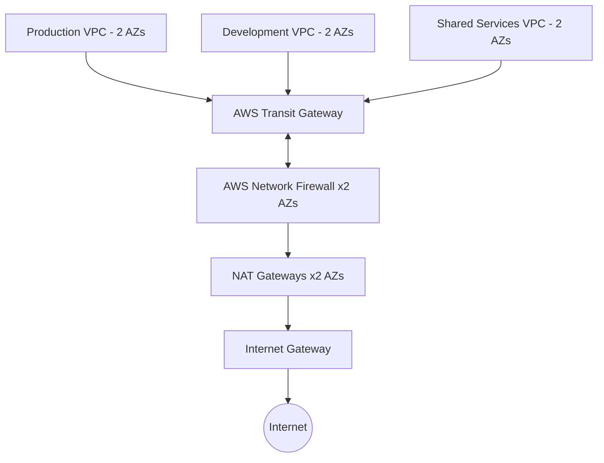

# AWS Network Firewall Security Hub

A deployment-ready, statically validated reference implementation of a
centralized multi-VPC AWS network-security platform using **AWS Network
Firewall**, **AWS Transit Gateway**, multiple Amazon VPCs, **Terraform**,
Suricata-compatible IPS rules, **CloudWatch**, **Amazon S3**, automated pytest
suites, and **GitHub Actions**.

> **Deployment status:** Deployed to AWS (runtime validation partial). SSM verified via PrivateLink. Centralized inspection routing has a runtime defect (0 packets to firewall). This project has
> **not** been deployed or traffic-tested in AWS yet. Use "deployed and
> validated" only after capturing real deployment and test evidence.

## Business problem

Organizations need a single, centralized inspection point for all east-west
and north-south traffic so that security policy is enforced consistently across
production, development, and shared-services environments. This repository
demonstrates that pattern without exposing workloads directly to the internet
and without relying on per-VPC security appliances.

## Architecture



A fuller diagram with Availability Zones, route tables, and return paths is in
`architecture/diagrams/architecture.mmd`. See `architecture/architecture.md`.

## Security controls

- Centralized AWS Network Firewall inspection for all workload egress and cross-VPC traffic.
- No direct internet gateway path from workload VPCs; egress is forced through inspection.
- No public IP addresses on workload instances.
- AWS Systems Manager (SSM) preferred over public SSH/RDP for administration.
- S3 log bucket with public access blocked, encryption, versioning, lifecycle, BucketOwnerEnforced.
- Least-privilege security groups and IAM roles.
- IMDSv2 required on test instances; EBS encryption enabled.
- Production tfvars enable firewall delete/subnet/policy change protection.

## Traffic-policy matrix

| Source | Destination | Protocol | Expected result |
| ----------------- | ---------------------------- | --------------------: | ---------------- |
| Production | Internet | HTTPS | Allow (to approved domains only) |
| Development | Internet | HTTPS | Allow (to approved domains only) |
| Production | Internet | Telnet | Block and alert |
| Development | Production | SSH | Block and alert |
| Development | Production | Application port | Block by default |
| Management subnet | Production | SSH | Allow |
| Production | Shared Services | Approved logging port | Allow |
| Workload VPCs | Approved DNS resolver | DNS | Allow |
| Workload VPCs | Unauthorized DNS resolver | DNS | Block |
| Any workload | Restricted domain | HTTP/HTTPS | Block |
| Any workload | Known prohibited IP set | Any | Block |
| Any VPC | Unapproved cross-VPC traffic | Any | Block |
| Return traffic | Established connection | Relevant protocol | Allow statefully |

The routing design prevents workloads from bypassing the inspection path.

## Repository structure

```text
aws-network-firewall-security-hub/
├── AGENTS.md
├── README.md
├── LICENSE
├── Makefile
├── .gitignore .gitattributes .editorconfig .pre-commit-config.yaml
├── architecture/        # architecture, routing, security-boundary, traffic-flow docs + mmd
├── docs/                # deployment, validation, operations, incident-response, cost, security-decisions, limitations, portfolio
├── terraform/
│   ├── versions.tf providers.tf main.tf variables.tf outputs.tf locals.tf
│   ├── environments/     # lab/ and production/ tfvars examples
│   └── modules/          # vpc, transit-gateway, inspection-routing, network-firewall, firewall-policy, logging, monitoring, test-workload
├── rules/               # Suricata stateful rules, stateless spec, domain lists, IP sets
├── scripts/             # validate, test-*, generate-test-traffic, analyze-firewall-logs, bootstrap, estimate-costs
├── tests/               # pytest suites (terraform structure/security/routing/naming, rules, utilities) + fixtures
└── .github/             # workflows + issue/PR templates
```

## Prerequisites

- Terraform `>= 1.5.0, < 2.0`
- AWS provider `~> 5.0`
- Python 3.10+ with `pytest`
- Optional: `tflint`, `checkov`, `tfsec`, `shellcheck`, `yamllint`, `markdownlint`, `pre-commit`

Static validation works **without** AWS credentials.

## Local validation

```bash
make validate
# or
scripts/validate.sh
```

The Makefile and `scripts/validate.sh` run each tool only when installed and
report skipped tools clearly.

### Manual commands

```bash
cd terraform
terraform fmt -check -recursive
terraform init -backend=false
terraform validate
cd ..
pytest
scripts/test-firewall-rules.sh
```

## Deployment steps

See `docs/deployment-guide.md` for the full staged guide. Summary:

1. Static validation (`make validate`) — no AWS credentials.
2. Read-only planning (`terraform init && terraform plan -out=tfplan`) — credentials required; never commit `tfplan`.
3. Human-reviewed deployment (`terraform apply tfplan`) — only after manual approval.
4. Traffic validation of allowed and blocked test cases.
5. Evidence capture (sanitized outputs, route tables, firewall policy, CloudWatch samples).
6. Cleanup (`terraform destroy`) — only after explicit approval.

## Testing steps

See `docs/validation-guide.md`. Static tests:

```bash
pytest -q                                  # 67+ tests
scripts/test-firewall-rules.sh
scripts/test-connectivity.sh               # --dry-run by default
```

## Example expected results

```text
=== terraform validate ===
Success! The configuration is valid.

=== pytest ===
67 passed

=== generate-test-traffic (dry-run) ===
scenario: blocked-telnet
  expected: BLOCK
  actual:   (dry-run, no traffic sent)
```

For deployed validation, `generate-test-traffic.py` exits non-zero when the
observed result differs from the expected result. See `tests/fixtures/` for
sanitized sample logs and run `scripts/analyze-firewall-logs.py` for a summary.

## Cost warning

This architecture may incur costs for AWS Network Firewall endpoints, traffic
processing, Transit Gateway attachments/processing, NAT Gateways, CloudWatch
Logs ingestion/retention, S3 storage, EC2 test instances, and cross-AZ traffic.
Review current AWS pricing before deploying. See `docs/cost-considerations.md`.

## Cleanup steps

See `docs/deployment-guide.md` (Stage 6). Remove test workloads first
(`enable_test_workloads = false`), then `terraform destroy` with explicit
approval. Logging resources are retained by default to preserve evidence.

## Limitations

Static tests prove configuration intent, not runtime behavior. AWS Network
Firewall does not provide full Suricata feature parity. See
`docs/limitations.md`.

## Portfolio demonstration

> Built a deployment-ready centralized AWS network-security platform using AWS
> Network Firewall, Transit Gateway, multiple VPCs, Terraform, Suricata-
> compatible IPS rules, CloudWatch monitoring, S3 log archival, automated
> security testing, and GitHub Actions.

See `docs/portfolio-demo.md` for a demo script.

## Resume bullet

- Designed and statically validated a centralized AWS Network Firewall
  inspection architecture across multi-VPC Transit Gateway topologies using
  Terraform, Suricata-compatible rules, CloudWatch monitoring, S3 log archival,
  automated pytest suites, and GitHub Actions CI.

## Disclaimer

Deployment status must be represented honestly. Use "designed and statically
validated" until the project has actually been deployed and tested in AWS with
preserved evidence. Only use "deployed and validated" after capturing real
deployment and test evidence.
