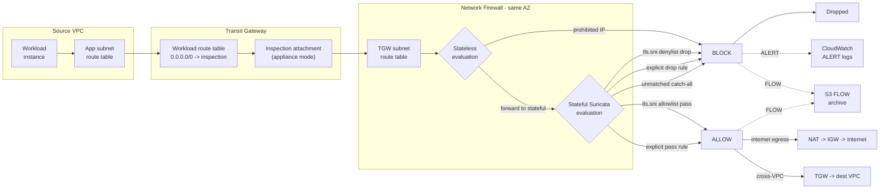
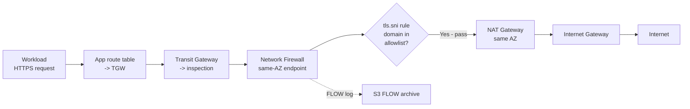
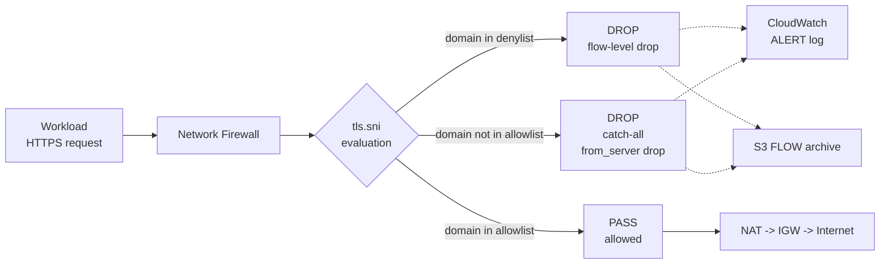
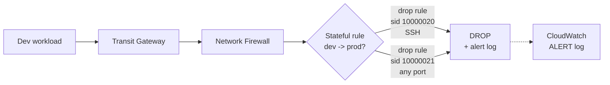
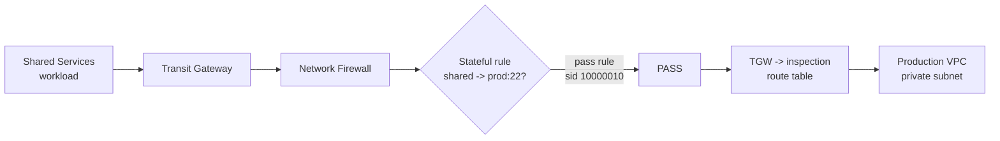
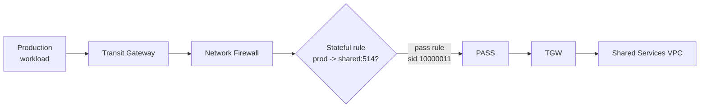
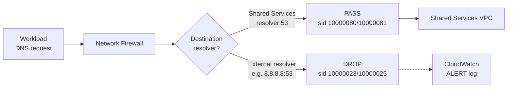
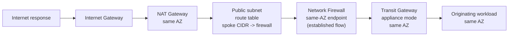

# Traffic flows

This document explains how traffic is processed by the centralized AWS Network
Firewall inspection architecture. The diagrams below show traffic decisions
(allow, block, alert) and the path each packet takes through route tables,
Transit Gateway, the firewall engine, NAT gateways, and logging.

The Mermaid source for the primary flow diagram is in
`architecture/diagrams/traffic-flow.mmd`.

## Firewall processing flow

The primary processing flow shows how every packet from a workload VPC is
routed through the firewall and evaluated by stateless then stateful rules
before reaching a destination or being dropped.

## Allowed HTTPS egress

When a workload requests an approved domain, the firewall passes the flow
and traffic exits through the NAT gateway and Internet Gateway.

## Blocked or unapproved HTTPS

Restricted domains are dropped by the tls.sni denylist. Unmatched HTTPS
domains are dropped by the catch-all from_server rule. Both generate alert
and flow logs.

## Inspected cross-VPC flows

Cross-VPC traffic is inspected by the firewall before reaching the destination
VPC. Approved flows pass through; unapproved flows are dropped.

### Development to Production - blocked

### Shared Services to Production SSH - allowed

### Production to Shared Services logging - allowed

## DNS decision flow

Workloads must use the approved DNS resolver in Shared Services. External DNS
resolvers are blocked.

## Symmetric return traffic

Transit Gateway appliance mode preserves Availability Zone affinity so that
return traffic passes through the same firewall endpoint as the forward path.

Appliance mode on the inspection TGW attachment ensures that traffic
ingressing AZ-a returns through AZ-a, keeping the forward and return paths
symmetric through the same firewall endpoint.

## Traffic-policy matrix

| Source | Destination | Protocol | Result | Path |
| --- | --- | --- | --- | --- |
| Production | Internet (allowed domain) | HTTPS | Allow | app->TGW->firewall->tls.sni pass->NAT->IGW |
| Development | Internet (allowed domain) | HTTPS | Allow | app->TGW->firewall->tls.sni pass->NAT->IGW |
| Shared Services | Internet (allowed domain) | HTTPS | Allow | app->TGW->firewall->tls.sni pass->NAT->IGW |
| Any workload | Restricted domain | HTTPS | Block | app->TGW->firewall->tls.sni drop |
| Any workload | Unmatched domain | HTTPS | Block | app->TGW->firewall->catch-all from_server drop |
| Production | Internet | Telnet | Block+alert | app->TGW->firewall->deny drop (sid 10000022) |
| Development | Production | SSH | Block+alert | app->TGW->firewall->deny drop (sid 10000020) |
| Development | Production | any app port | Block | deny drop (sid 10000021) |
| Shared Services | Production | SSH | Allow | app->TGW->firewall->allow pass (sid 10000010) |
| Production | Shared Services | 514/tcp | Allow | allow pass (sid 10000011) |
| Workloads | Shared Services resolver | 53 udp/tcp | Allow | dns pass (sid 10000080/10000081) |
| Workloads | External resolver | 53 udp/tcp | Block | deny drop (sid 10000023/10000025) |
| Any workload | Prohibited IP set | any | Block | stateless drop + deny drop (sid 10000024) |
| Return | established | relevant | Allow | firewall stateful + appliance-mode symmetric return |

## Notes

- HTTPS egress is allowlist-only via native Suricata `tls.sni` rules (priority 55).
- Blocked domains are dropped via `tls.sni` denylist rules within the same group.
- Unmatched HTTPS server responses are dropped by the catch-all `from_server` rule.
- Drop actions emit alert and flow logs (block and alert in one rule).
- NFW FLOW logs are archived to S3; ALERT logs go to CloudWatch.
- VPC Flow Logs go to CloudWatch (separate from NFW logs).
- The stateful default is `alert_strict` which allows the TCP handshake to
  complete so `tls.sni` rules can evaluate the SNI before applying the verdict.
- No workload VPC has an Internet Gateway; direct bypass is not possible.
- Runtime validation confirmed all 20 traffic tests pass with this design.
